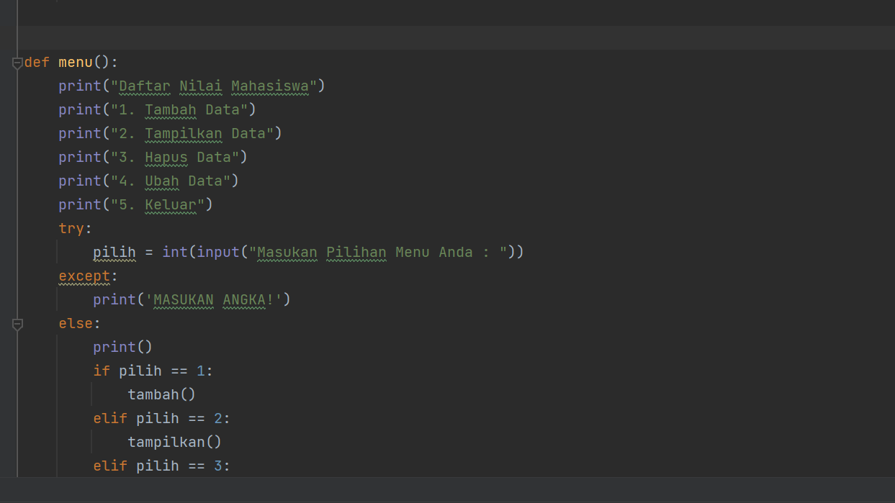

# Try-dan-Exception
- Penjelasan mengenai Try dan Exception
Program exception ini menggunakan file praktikum class pada lab sebelumnya. 

Program Try & Exception:

Jika dimasukan data tipe string maka akan muncul tampilan seperti berikut.
Masukanlah angka untuk memilih menu yang tersedia.

variabel nim merupakan tipe data integer.
Jika inputnya salah maka akan muncul tampilan seperti berikut (MASUKAN ANGKA!)
Masukan nim dengan angka.

variabel nilai UAS merupakan tipe data integer.
Jika inputnya salah maka akan muncul tampilan seperti berikut (MASUKAN ANGKA!)
Masukan nilai UAS dengan angka, bukan dengan huruf.

